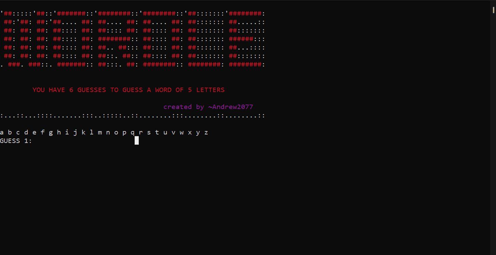
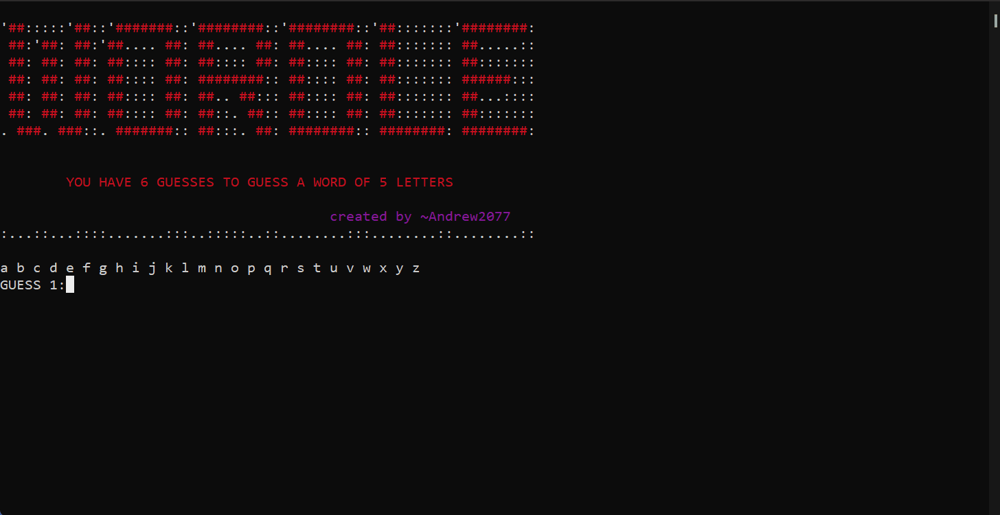

## **Wordle game in CMD**
wordle is a famouse word guessing game. and for whom doesn't knwo the game here's a simple **[tutorial](https://archive.ics.uci.edu/ml/datasets/PAMAP2+Physical+Activity+Monitoring)** for the game.

you can try [**Wordle**](https://wordlegame.org) yourself before hitting my project

___
## **Table Of Contents**
- [**Wordle game in CMD**](#wordle-game-in-cmd)
- [**Table Of Contents**](#table-of-contents)
- [**The Idea of the project**](#the-idea-of-the-project)
- [**How to play**](#how-to-play)
- [**Project Guideline**](#project-guideline)
- [**Cheat**](#cheat)
- [**Future Work**](#future-work)

___
## **The Idea of the project**
copy and modify the know game worlde.
it's almost the same game but with fewers words to predict and less fancy animation. cause im not using Css or Qt yet.

there are 2500 words to guess from they are found in **[valid_words_5](valid_words_5.py)** you can add your own words and try gueessing them.
___

## **How to play**
- all wordle games are the same just guess words know to the game 

- here's an example for winning the game 
  

- here's an example for me losing the game 

___
## **Project Guideline**  

  1. creating a file **[[valid_words_5]](valid_words_5.py)** to be your data set of words to guess.
  2. creating a file **[[wordle_game]](wordle_game.py)** to be your game.
  3. creating a file **[[main]](main.py)** your game intialization in cmd.
  4. **[[wordle]](wordle.py)** is file modified to contain all the files above ,so that the game can be in 1 file project. 
  5. converting worlde.py to worlde.exe to run the game in cmd.

---
## **Cheat**
**[Cheat](Human_activity_recognition.pdf)** is where the Random choosed is saved, so you can use it to cheat. and finish the game.

---
## **Future Work**

- adding more words
- guessing different lenghtes words
- Website
- QT GUI

---

